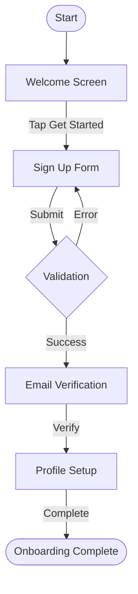

# Flow Analyzer

Extract structured user flow documentation from screen recordings or screenshot sequences.

## What This Skill Does

Takes a video file or image sequence of a digital product and produces:

1. **Flow inventory** — Each unique screen identified and classified
2. **Screen detail cards** — Type, key components, and primary interaction per screen
3. **Mermaid flowchart** — Visual diagram of the complete flow with transitions
4. **Markdown report** — Full structured documentation ready for sharing

## Input Formats

| Input  | Supported Formats                | Notes                             |
| ------ | -------------------------------- | --------------------------------- |
| Video  | `.mp4`, `.mov`, `.webm`, `.mkv`  | Extracted to keyframes via ffmpeg |
| Images | `.png`, `.jpg`, `.jpeg`, `.webp` | Analyzed directly in sequence     |

## Input Preparation

Before uploading, consider these platform limits and tips:

**Claude.ai limits:**

- Maximum 30 MB per file
- Up to 20 files per chat
- Images: JPEG, PNG, GIF, WEBP (recommended ≥1,000×1,000 px)

**Video tips to stay within limits:**

- A 3-minute mobile screen recording at 60fps typically weighs ~20-25 MB — right at the edge
- Desktop recordings at full resolution can hit 30 MB in under a minute
- Record at 720p if the goal is flow documentation (not pixel-perfect audit)
- Compress before uploading: use Handbrake, QuickTime (Export → 720p), or FFmpeg
- For long recordings (>3 min), split into segments and analyze each separately

**When to use screenshots instead of video:**

- Each screenshot weighs ~50-200 KB, so 20 images = ~2-4 MB total (well under limits)
- Better for flows you already know — capture each screen state manually
- Better quality per frame (no compression artifacts, no motion blur)
- Ideal when you want to control exactly which screens get documented

**Quick compress command (if you have FFmpeg locally):**

```bash
ffmpeg -i input.mov -vf "scale=720:-2" -crf 28 -preset fast output.mp4
```

This reduces resolution to 720p width and compresses aggressively — usually cuts file size by 60-80%.

## Workflow

### Step 1: Extract Frames (video only)

If the input is a video file, extract keyframes using ffmpeg. The goal is to capture
each distinct screen state without redundant frames.

```bash
# Install ffmpeg if needed
which ffmpeg || sudo apt-get install -y ffmpeg

# Create output directory
mkdir -p /home/claude/flow-frames

# Extract keyframes — one frame every 2 seconds is a good default.
# For short recordings (<30s), use 1 frame/second.
# For long recordings (>2min), use 1 frame every 3-4 seconds.
ffmpeg -i "<INPUT_VIDEO>" -vf "fps=0.5" -q:v 2 /home/claude/flow-frames/frame_%04d.jpg
```

After extraction, review the frames and deduplicate — remove frames that show
the same screen state (e.g., mid-scroll, cursor movement without state change).
Keep only frames that represent distinct screen states or meaningful transitions.

### Step 2: Analyze Each Frame

For each unique frame/screenshot, identify:

1. **Screen type** — Classify using the taxonomy in `references/screen-taxonomy.md`
2. **Key components** — The 3-5 most important UI elements visible (navigation, forms, CTAs, media, cards, etc.)
3. **Primary interaction** — What the user is expected to do on this screen (fill form, select option, confirm action, read content, etc.)
4. **Platform** — Web desktop, web mobile, or native mobile app
5. **Screen label** — A short descriptive name with numeric prefix indicating order of appearance (e.g., "01 — Sign Up Form", "02 — Email Verification", "03 — Profile Setup")

### Step 3: Identify Flow Type

Based on the collection of screens, classify the overall flow:

| Flow Type         | Typical Screens                                             |
| ----------------- | ----------------------------------------------------------- |
| Onboarding        | Welcome, value prop, permissions, profile setup, completion |
| Authentication    | Login, register, forgot password, verification, MFA         |
| Checkout/Purchase | Cart, shipping, payment, review, confirmation               |
| Search & Browse   | Search bar, filters, results, detail view                   |
| Content Creation  | Editor, preview, publish, success                           |
| Settings/Profile  | Form fields, toggles, save confirmation                     |
| Invite/Share      | Contact selection, message compose, send confirmation       |
| Error Recovery    | Error state, retry, resolution, success                     |
| Upgrade/Upsell    | Feature comparison, plan selection, payment, welcome        |

If the flow doesn't match these categories, create a custom classification with a clear label.

### Step 4: Generate Outputs

Produce three files:

#### A. Markdown Report (`flow-analysis.md`)

Use this exact template structure:

```
# Flow Analysis: [Flow Name]

## Overview
- **Product**: [Product name if identifiable]
- **Platform**: [Web Desktop / Web Mobile / Native Mobile]
- **Flow Type**: [From taxonomy above]
- **Total Screens**: [Count]
- **Date Analyzed**: [Date]

## Flow Diagram

(Embed the mermaid diagram inline here)

## Screen Inventory

### Screen 1: [Label]
- **Type**: [Screen type from taxonomy]
- **Key Components**: [Component 1], [Component 2], [Component 3]
- **Primary Interaction**: [What the user does here]
- **Notes**: [Any observations about patterns, issues, or notable design decisions]

### Screen 2: [Label]
(repeat for each screen)

## Flow Observations
- [Pattern 1 observed]
- [Pattern 2 observed]
- [Any UX issues or friction points noticed]
```

#### B. Mermaid Diagram (`flow-diagram.mermaid`)

Generate a standalone Mermaid file using flowchart TD (top-down) syntax.

Guidelines for the diagram:

- Use descriptive node labels, not just "Screen 1"
- Use appropriate shapes: rounded rectangles for screens, diamonds for decisions, stadium shapes for start/end
- Show transitions with labeled arrows describing the user action
- Group related screens in subgraphs if the flow has distinct phases
- Keep it readable — if 10+ screens, break into phases with subgraphs

Example:



#### C. Screen Inventory (`screen-inventory.jsx`)

Generate a React artifact that renders each unique screen as a wireframe card in a grid.

Requirements:

- Each screen rendered as a simplified wireframe inside a mobile phone frame (aspect ratio 9:16)
- Screens labeled with numeric prefix indicating order of appearance: "01 — Home / Dashboard"
- Below each wireframe: the screen label and screen type
- Clicking a card reveals a detail panel with: primary interaction, key components list, and corresponding Mermaid node reference
- Use Tailwind utility classes for styling
- Wireframes should be schematic — use simple boxes, text, and icons to represent UI elements. Not pixel-perfect, but recognizable.
- Grid layout: 6 columns on large screens, 4 on medium, 3 on small, 2 on mobile

Structure each screen in the data array as:

```javascript
{
  id: 1,
  label: "01 — Screen Name",
  type: "Screen Type from taxonomy",
  interaction: "What the user does here",
  components: ["Component 1", "Component 2"],
  mermaidNode: "B[Screen Name]",
  wireframe: ( /* JSX wireframe */ )
}
```

### Step 5: Present Results

1. Save all three files to `/mnt/user-data/outputs/`
2. Present the Screen Inventory JSX first (visual wireframe grid — most immediately useful)
3. Present the Mermaid file second (flow diagram renders visually in the UI)
4. Present the Markdown report third (full textual documentation)
5. Provide a brief verbal summary: flow type, total screens, notable patterns or friction points

## Important Considerations

- **Deduplication is key**: Screen recordings have many nearly-identical frames.
  Be aggressive — only keep frames with meaningful state changes.
- **Ambiguous screens**: If a frame is unclear or transitional (loading spinners,
  mid-animation), mark as "Transition" and move on. Don't force a classification.
- **Multiple flows in one recording**: If the recording covers multiple distinct flows
  (e.g., login then checkout), split into separate sections with separate diagrams.
- **Frame quality**: If extracted frames are blurry, re-extract at higher quality (`-q:v 1`)
  or higher fps.
- **Large videos**: For videos longer than 5 minutes, warn the user and focus on
  the first ~50 keyframes. Ask if they want a specific time range.

## Edge Cases

- **Single screenshot**: Produce a screen analysis card without a flow diagram.
- **Very short recording (<5s)**: Extract at 2fps and analyze all frames.
- **No clear flow**: Report as "Exploratory Browse" — list screens without implying task sequence.

## References

For screen type classifications, see: `references/screen-taxonomy.md`
