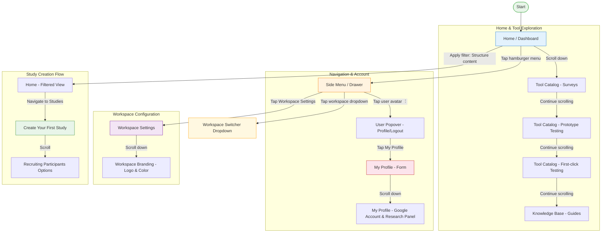

# Flow Analysis: Optimal Workshop — Platform Exploration

## Overview

- **Product**: Optimal Workshop (UX Research Platform)
- **Platform**: Web Mobile (Safari on iOS)
- **Flow Type**: Exploratory Browse / Platform Onboarding
- **Total Screens**: 12 unique screens
- **Date Analyzed**: February 11, 2026
- **Recording Duration**: ~2:50 min

## Flow Diagram

## Screen Inventory

### Screen 1: Home / Dashboard

- **Type**: Home / Dashboard
- **Key Components**: Top nav bar with hamburger menu, trial banner ("Your free trial ends in 7 days" + "Upgrade now" CTA), welcome greeting, filter chips (Explore the problem, Validate solutions, Structure content, Gather feedback), tool cards below
- **Primary Interaction**: Choose a tool or filter to create a study
- **Notes**: The trial banner takes significant vertical space on mobile, pushing the main content down. The greeting is personalized ("Hello Martin"). Filter chips provide a goal-oriented entry point to the tool catalog.

### Screen 2: Tool Catalog — Surveys

- **Type**: Detail View (within catalog)
- **Key Components**: Survey tool card with icon, description ("Quickly gather feedback from real users..."), tags (Quantitative | Unmoderated), action buttons (+New, ▶Intro, 🔍Example)
- **Primary Interaction**: Start a new survey, watch intro, or view example
- **Notes**: Each tool card follows the same pattern: icon, name, description, methodology tags, and 3 action buttons. Consistent and scannable.

### Screen 3: Tool Catalog — Prototype Testing

- **Type**: Detail View (within catalog)
- **Key Components**: Prototype testing card with icon, description, tags (Quantitative | Unmoderated), same 3 action buttons
- **Primary Interaction**: Start a new prototype test
- **Notes**: Same card pattern as Surveys. The catalog is a vertically scrollable list of tool cards.

### Screen 4: Knowledge Base — Guides

- **Type**: List / Feed
- **Key Components**: Guide cards ("101 guide to tree testing", "101 guide to prototype testing"), each with illustration, title, and description
- **Primary Interaction**: Read a guide to learn about a methodology
- **Notes**: Educational content is integrated into the home page below the tool catalog. Good onboarding pattern for new users.

### Screen 5: Side Menu / Drawer

- **Type**: Side Menu / Drawer
- **Key Components**: User name and workspace ("Martin Gomez Kennedy (RedSalu...)"), navigation items (Home, Studies), utility links (Give feedback ↗, Help center ↗), user avatar with overflow menu
- **Primary Interaction**: Navigate between main sections
- **Notes**: Minimal navigation with only 2 primary destinations (Home, Studies). The workspace name is truncated on mobile. External links open in new tabs (↗ indicator).

### Screen 6: User Popover — Profile/Logout

- **Type**: Dropdown Open
- **Key Components**: Popover with "My profile" and "Logout" options, appears from user avatar ⋮ menu
- **Primary Interaction**: Access profile or log out
- **Notes**: This is a small contextual popover overlaying the side menu. Simple and focused — only 2 options.

### Screen 7: My Profile — Form (top)

- **Type**: Settings / Profile View
- **Key Components**: Header "My Profile" with email, Name fields (first/last), Email (read-only), Job Title (empty), Organization Name (empty)
- **Primary Interaction**: Edit profile information
- **Notes**: Email field appears read-only (greyed out). Job Title and Organization Name are empty — these feel like optional fields that the user hasn't completed.

### Screen 8: My Profile — Google Account & Research Panel (bottom)

- **Type**: Settings / Profile View (scroll continuation)
- **Key Components**: Google Account Login section (connected status, "Disconnect Google account" button), Research Panel opt-in checkbox, "Update details" button, footer
- **Primary Interaction**: Manage Google SSO connection, opt in to research panel, save changes
- **Notes**: The Google SSO section is prominent with a clear disconnect option. The Research Panel opt-in is a nice community engagement pattern. The "Update details" CTA is at the bottom.

### Screen 9: Expanded Navigation Menu

- **Type**: Side Menu / Drawer (variant)
- **Key Components**: Full navigation menu (Home, Studies, Switch Workspace, Workspace Settings, Invite Members, My Profile, Log out), trial badge ("Free trial - 7 days left"), "Upgrade subscription" CTA button, user profile fields visible below
- **Primary Interaction**: Access all navigation destinations and account actions
- **Notes**: This is a different menu variant from Screen 5 — shows more options including workspace management. The upgrade CTA is prominent in green. The profile form appears to scroll behind/below this menu.

### Screen 10: Workspace Settings

- **Type**: Settings
- **Key Components**: Tab navigation (Workspace settings, Members, Usage report, Plans, Billing, Features), Workspace Name field, Workspace Subdomain field with warning about changing links
- **Primary Interaction**: Configure workspace settings across multiple categories
- **Notes**: Rich settings section with 6 tabs. The subdomain warning is a good preventive UX pattern. This is clearly an admin-level screen.

### Screen 11: Workspace Branding — Logo & Color

- **Type**: Settings (scroll continuation)
- **Key Components**: Logo upload zone ("Drop image file here" with format hints), Color picker with hex value (#007A66), "Update" button
- **Primary Interaction**: Upload workspace logo and set brand color
- **Notes**: Basic branding customization. The drag-and-drop zone is clear. Only one brand color — minimal but functional.

### Screen 12: Workspace Switcher Dropdown

- **Type**: Dropdown Open
- **Key Components**: Workspace selector dropdown showing current workspace with checkmark, "Workspace settings" shortcut, "Invite members" shortcut
- **Primary Interaction**: Switch between workspaces or access workspace management
- **Notes**: The dropdown appears inside the side menu. Includes quick shortcuts to settings and invite — smart consolidation.

### Screen 13: Create Your First Study

- **Type**: Category / Browse (Onboarding-oriented)
- **Key Components**: Heading "Create your first study", study type cards (Surveys, Qualitative Insights, etc.), same card pattern as home tool catalog
- **Primary Interaction**: Choose a study type to get started
- **Notes**: This is the Studies section empty state — it functions as a guided entry point. The heading shifts from "Welcome to Optimal" to "Create your first study", indicating progression.

### Screen 14: Recruiting Participants Options

- **Type**: Category / Browse
- **Key Components**: "Recruiting participants" section header, Managed Recruitment card ("Fully managed by our team"), Standard Recruitment card ("Self-serve and on-demand")
- **Primary Interaction**: Choose a participant recruitment method
- **Notes**: Two clear options with different levels of service. This appears below the study tools on the Studies page.

## Flow Observations

- **Flow type is Exploratory Browse**: The recording shows the user exploring the platform for the first time after signup — visiting the home page, browsing tools, opening menus, checking profile and settings. There is no single task being completed.
- **Two navigation patterns coexist**: The side drawer (Screen 5) shows a simplified menu, while the expanded menu (Screen 9) shows the full navigation. This inconsistency could confuse users — it's unclear what triggers each variant.
- **Trial pressure is persistent**: The upgrade banner appears on every page and the trial badge is in the menu. The user sees "7 days left" messaging constantly throughout the exploration.
- **Empty states guide action**: The Studies section (Screen 13) uses an empty state to guide the user toward creating their first study — good progressive onboarding.
- **Profile is incomplete**: Job Title and Organization Name are empty, suggesting the onboarding flow didn't prompt for these. This is a missed opportunity for personalization.
- **Mobile experience has truncation issues**: Workspace names and user names are frequently truncated on mobile, reducing scannability.
- **Consistent card pattern**: All study tools follow an identical card structure (icon, name, description, tags, 3 CTAs), which is excellent for learnability and scalability.
- **Branding customization is minimal**: Only logo + 1 hex color. Enterprise users might expect more (favicon, multiple brand colors, typography options).
